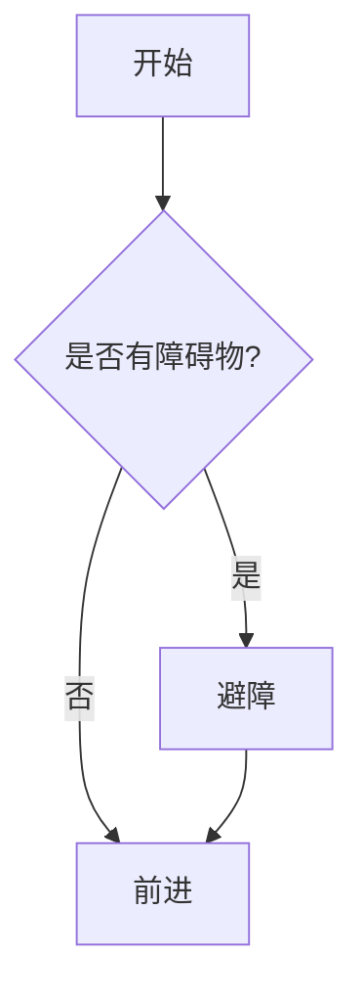

你好！欢迎来到我的机器人技术博客。这是一篇演示文章，展示了如何在 Chirpy 主题中使用 LaTeX 公式、代码块以及嵌入 B 站视频。

## 1. LaTeX 公式支持

我们在机器人学中经常需要使用数学公式，例如旋转矩阵：

$$
R_z(\theta) = \begin{bmatrix}
\cos \theta & -\sin \theta & 0 \\
\sin \theta & \cos \theta & 0 \\
0 & 0 & 1
\end{bmatrix}
$$

或者行内公式，如欧拉公式 $e^{i\pi} + 1 = 0$。

## 2. 代码块高亮

这是一个简单的 Python 代码示例，用于通过 ROS 发布消息：

```python
#!/usr/bin/env python
import rospy
from std_msgs.msg import String

def talker():
    pub = rospy.Publisher('chatter', String, queue_size=10)
    rospy.init_node('talker', anonymous=True)
    rate = rospy.Rate(10) # 10hz
    while not rospy.is_shutdown():
        hello_str = "hello world %s" % rospy.get_time()
        rospy.loginfo(hello_str)
        pub.publish(hello_str)
        rate.sleep()

if __name__ == '__main__':
    try:
        talker()
    except rospy.ROSInterruptException:
        pass
```

## 3. 视频嵌入

### Bilibili 视频
支持直接嵌入 B 站视频，只需提供 BV 号。
下面的示例视频展示了相关技术（示例视频）：



### YouTube 视频 (可选)
如果需要嵌入 YouTube 视频：



## 4. Mermaid 流程图

我们也可以画流程图：



希望这些功能能满足你的写作需求！
